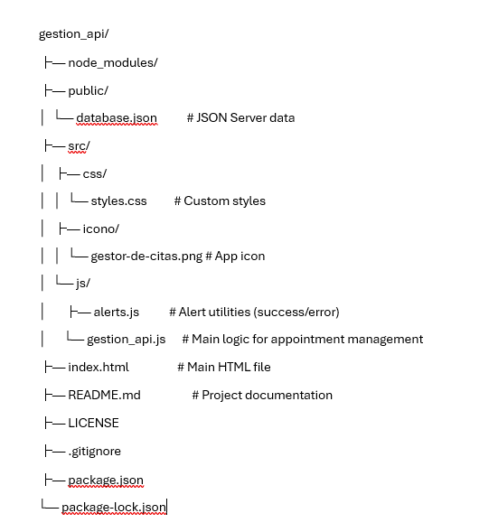

# GESTION_API

gestion_api is a simple frontend project built for developers to practice making HTTP requests using either Fetch API or Axios, in combination with JSON Server. It features a clean, responsive UI built with Bootstrap 5, and allows users to list and add patients through a simulated REST API.

---

## 🚀 Features

- 📋 View a list of all appointments
- ➕ Add new appointments
- ✏️ Edit existing appointments
- 🗑️ Delete appointments
- 🔄 Real-time updates using Fetch API

---

## 🛠️ Technologies Used

- HTML5 & CSS3
- JavaScript (Vanilla)
- [JSON Server](https://github.com/typicode/json-server) – Fake REST API
- Bootstrap 5 (for UI styling)

---

## 📦 Installation

1. **Clone the repository**  
   Go to your terminal and run:  
   `git clone https://github.com/RafaeRamirez/gestion_api.git`  
   Then enter the folder:  
   `cd gestion_api`

2. **Install JSON Server**  
   If you don't have it installed globally, run:  
   `npm install -g json-server`

3. **Start the JSON Server**  
   Run the following command to start the fake API:  
   `json-server --watch public/database.json --port 3000`  
   The API will be available at: http://localhost:3000/appointments

4. **Open the project**  
   Open the file `index.html` in your browser, either by double-clicking it or by using Live Server in your code editor.

---

## 📁 Project Structure




## 📌 API Endpoints

- `GET /appointments` – Fetch all appointments
- `POST /appointments` – Create a new appointment
- `PUT /appointments/:id` – Update an appointment
- `DELETE /appointments/:id` – Delete an appointment

---

## ✅ Example Data (`database.json`)

```json
{
  "appointments": [
    {
      "id": 1,
      "name_pet": "Max",
      "name_person": "John Doe",
      "phone_person": "1234567890",
      "date": "2025-07-05"
    }
  ]
}
💡 Notes
This is a learning project built to practice frontend development and RESTful API consumption. All data is stored locally using JSON Server.

👨‍💻 Author
Rafael Augusto Ramírez Bolaño

💼 Clan: Caimán

📧 Email: rafar1129@gmail.com

🔗 Project Link: https://github.com/RafaeRamirez/gestion_api

```
